# 原神锄地自动传送

## 一、使用教程

### 1. 右下角传送

将鼠标移动到锚点的位置，点击鼠标侧键1，也就是G5键，可以直接传送。（帮你点确认），如果锚点需要多选，需要单击锚点，对选项进行侧键1，才能传送。这个侧键就是帮你点确认的。

> 虽然我可以让它变成即便多个锚点也能帮你选择进行传送，但是如果你没有点歪了，没有点到锚点，会切换到尘歌壶，所以后来我把自动帮你选这个功能取消了。


### 2. 自动传送

启动`main.ahk`脚本，进行自动传送。

点击键盘`->`键，自动传送，可以修改`main.ahk`中的`fastMode := true`，直接打开地图传，如果设置为`fastMode := false`，则全程使用F1追怪传送。


### 3. 自动吃药

点击键盘的`Tab`键，可以自动吃药。需要配置你要吃的药的列表：

```
global foodList := [[1244, 773], [1801, 768], [2373, 775]]
```


### 4. 快捡

请运行`pick.ahk`进行快捡，默认不开启，运行成功后，需要按侧2键进入快捡模式。再次按侧2键停止快捡。

进入快捡模式后，长按F一直捡，停止按F就停止捡。


### 5. 自动冲刺

请运行`run.ahk`文件，目前的自动冲刺适合成男成女角色。跑跳的还没写。


### 6. qm传送

**全局qm**

将`main.ahk`文件中的qmMode改为true

```
global debugMode := true
```

**本次qm**

按住`Alt + ->`键【按住Alt，然后键盘右键】，qm传送，注意，这个qm的延迟适合夜兰，琴有概率失败。


### 7. 更新脚本

如果你改动了脚本，建议重新拉代码。或者把你的脚本提交到网站上。

如果你没有改动脚本，直接更新：


### 8. 自己标路线

将`main.ahk`文件中的debugMode改为true

```
global debugMode := true
```

打开原神后，按键盘的上方向键可以获取当前鼠标的坐标，用来标点，将标点移动到你要传送的锚点，按上键，就可以将坐标复制到你的剪切板，直接粘贴到路线文件里面即可。

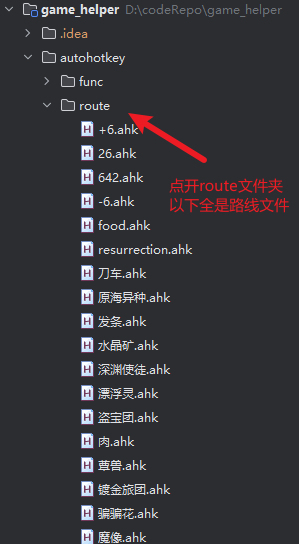

新建一个路线文件：

```
global routes := [
    {monster: [2, 1], pos2K: [758, 186], name: "风龙废墟"}, ; 1
]
```

- monster：你要追踪的怪在第几行第几列。
- pos：分辨率（1920 * 1080）下的坐标。
- pos2K：分辨率（2560 * 1440）下的坐标。
- pos25K：分辨率（2560 * 1600）下的坐标。
- pos4K：分辨率（3840* 2160）下的坐标。
- name：名称。
- narrow：缩小地图（正数为缩小，负数为放大）
- wheel：滚轮（正数缩小，负数放大）
- posFast4K：分辨率（3840* 2160）下开地图直传下的坐标【其他分辨率的加fast即可】
- movX：左右拖动地图【带对应的分辨率】
- movY：上下拖动地图【带对应的分辨率】

> Tips:
>
> 按`Ctrl + D`可以复制粘贴当前行，方便制作路线。


## 二、安装教程

### 1. 下载git

访问git官网：https://git-scm.com

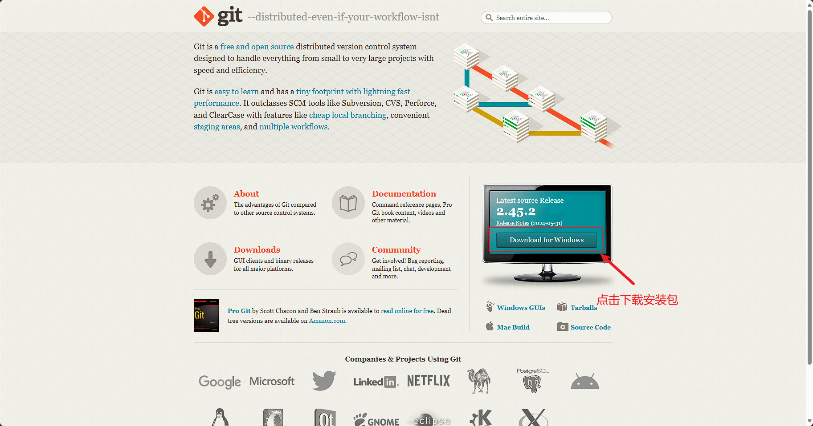

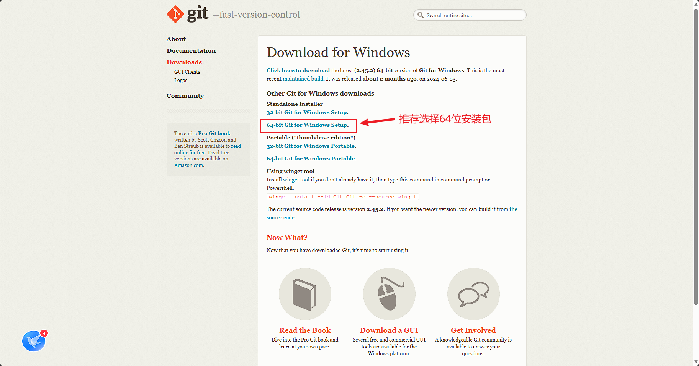

之后一路点击Next安装成功。


### 2. 安装jetbrains toolbox

访问链接直接下载：[感谢您下载 Toolbox App！ (jetbrains.com.cn)](https://www.jetbrains.com.cn/toolbox-app/download/download-thanks.html)

一路点击Next安装。

安装完成后打开toolbox安装IDEA。

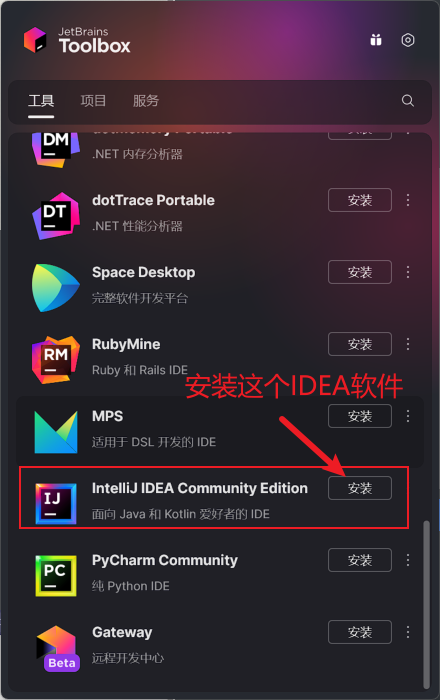

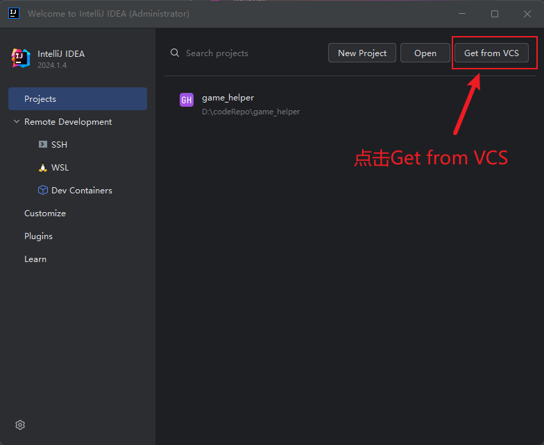


访问以下代码网站：[代码链接](http://106.55.181.191:12200/root/game_helper)

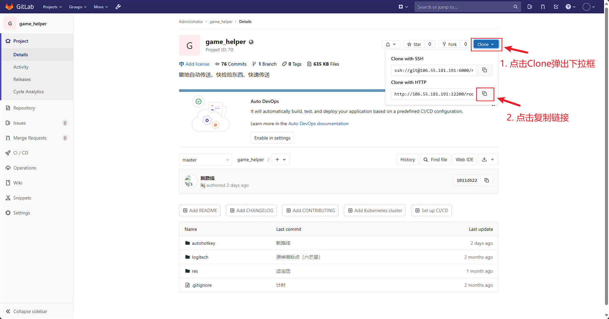


把复制的链接粘贴到IDEA中。

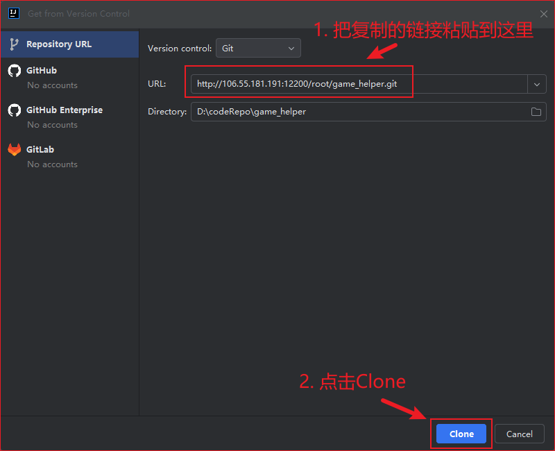

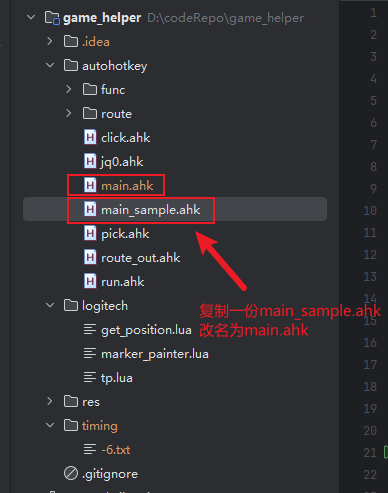


### 3. 打开Settings，下载autohotkey插件

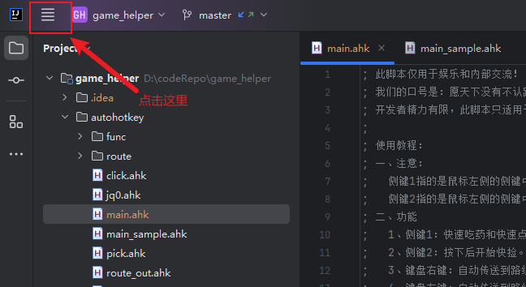

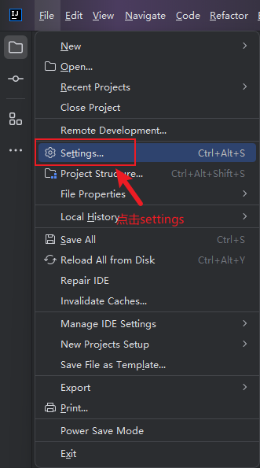

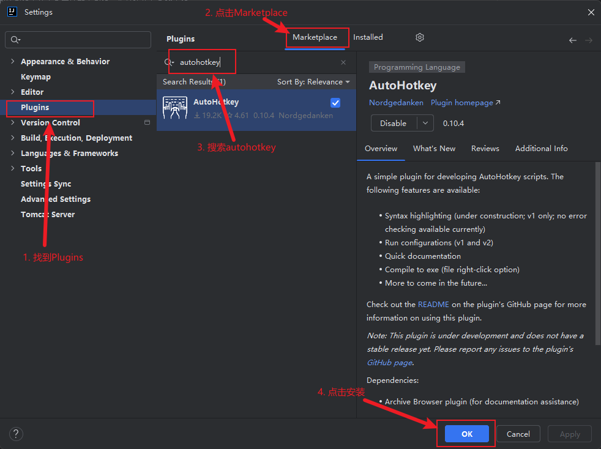

安装插件后可能需要重新启动IDEA，先关闭，然后按win键搜索，一定要以管理员方式打开，以后每次都要以管理员方式打开，也可以在jetbrains toolbox中配置以管理员方式打开（请自行摸索）

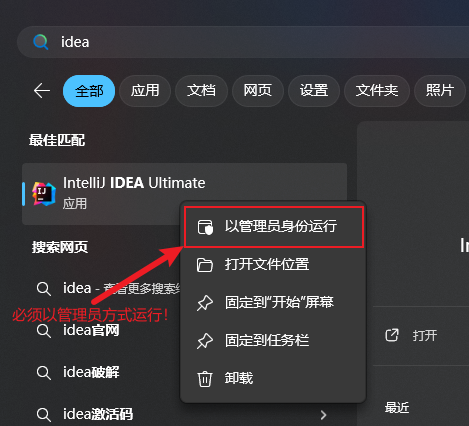

### 4. 再次打开Settings，配置autohotkey的地址

这里打开Settings和上面一样。


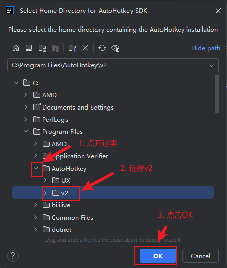

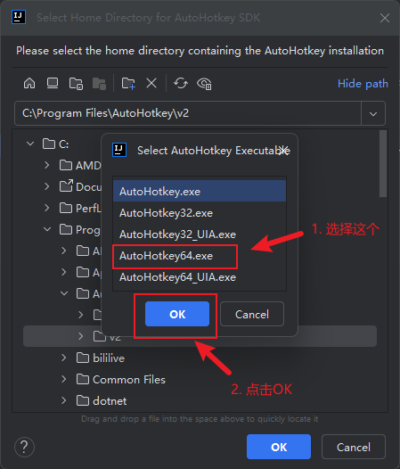

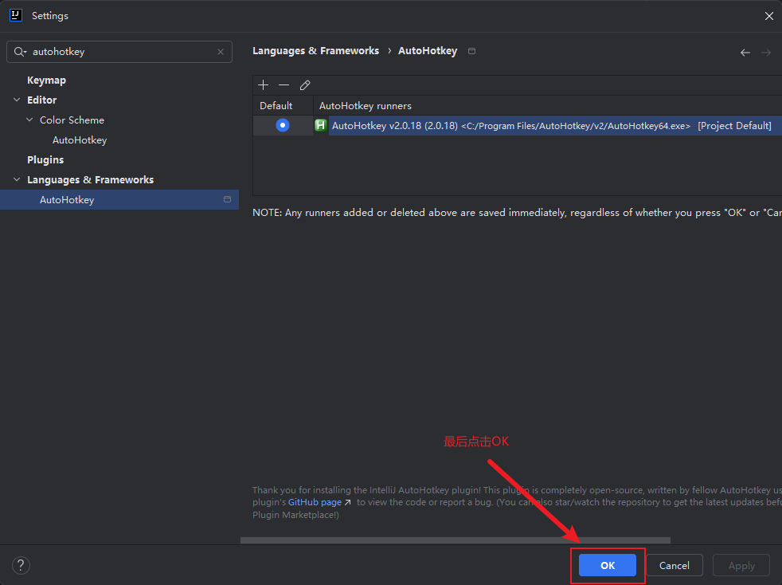

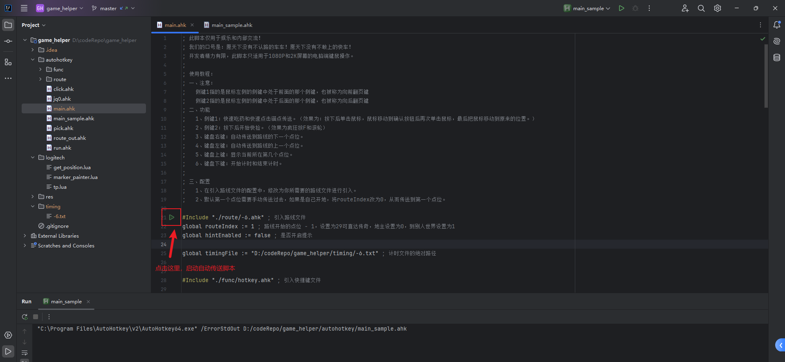


### 5. 运行/重新运行/停止脚本

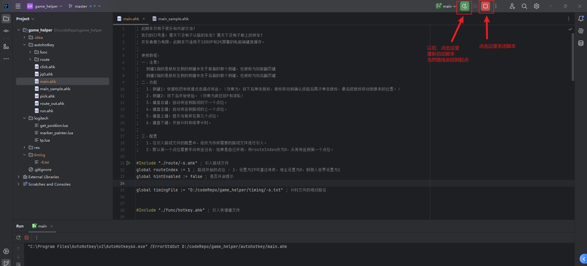


